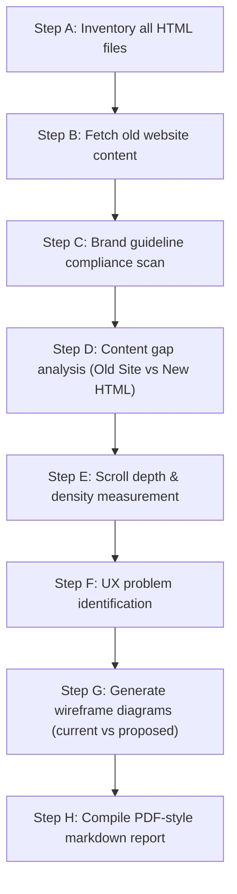
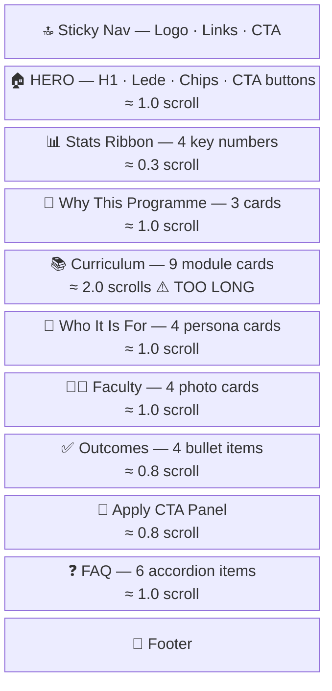
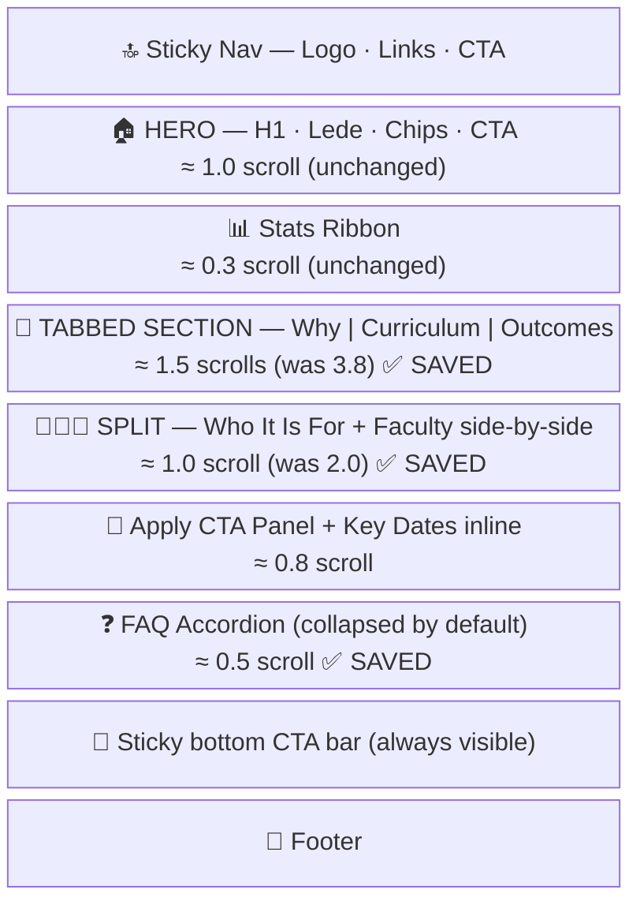

# IIMBx Comparative Audit & UX Recommendation Skill
**Version:** 1.0 | **Maintained by:** IIMBx Brand Team | **Last updated:** May 2026

> **Purpose:** This skill file defines the complete procedure for producing a **side-by-side comparative audit** of IIMBx HTML landing page prototypes. It compares new prototypes against brand guidelines and old website content, then generates actionable UX recommendations with **wireframe diagrams** (ASCII/Mermaid) to reduce scroll depth and improve conversion. The output is a single, self-contained markdown artifact formatted like a PDF report.

---

## §1 · When to Invoke This Skill

**Trigger phrases:**
- *"Compare the pages"*
- *"Run a comparative audit"*
- *"Old vs new comparison"*
- *"Compare with guidelines and old website"*
- *"Show me what's different and what to fix"*
- *"Create a PDF-style comparison report"*
- Any request that implies comparing HTML prototypes against each other, against the brand playbook, or against the live/old site content.

**Scope:** This skill covers **all HTML files** in the workspace unless the user specifies a subset. It produces one unified report.

---

## §2 · Execution Pipeline (Follow in Order)



### Step A — Inventory All HTML Files
1. Use `list_dir` to confirm which `.html` files exist in the workspace.
2. Use `view_file` on each HTML file to extract:
   - `<title>` tag content
   - `<h1>` content
   - Section count (count `<section>` tags and major landmark divs)
   - CSS variable declarations (`:root` block)
   - Google Fonts import URL
   - Total line count as a proxy for page complexity.
3. Record a **File Inventory Table** in the report.

### Step B — Fetch Old Website Content
1. For each programme identified, check `AGENTS.md §4` for pre-loaded reference data.
2. If §4 data is insufficient (missing FAQs, latest dates, testimonials), fetch from the live site:
   - Search using `mcp_exa_web_search_exa` with: `"IIMBx [programme name] site:iimbx.iimb.ac.in"`
   - Fetch the URL using `mcp_exa_web_fetch_exa` with `maxCharacters: 6000`
3. Extract and note: programme title, duration, module/course names, faculty names, testimonials, fees, FAQs, contact details.
4. Record findings per programme in a **Source Content Table**.

### Step C — Brand Guideline Compliance Scan
For each HTML file, check every rule from `AGENTS.md §3` and `IIMBx_Content_Audit_Skill.md §1`:

**Color Audit:**
- Extract all hex values from the `<style>` block.
- Confirm `--paper` / canvas color = `#F4EFE3`
- Confirm `--marigold` / accent = `#C97138`
- Confirm `--char` / charcoal = `#1A1B1E`
- Flag any instance of banned colors (green, teal, eucalyptus, apricot, purple) — check both CSS variables AND inline styles.
- Evaluate 70/15/15 ratio compliance.

**Typography Audit:**
- Confirm Google Fonts import includes `Source Serif 4`, `Inter`, `IBM Plex Mono`.
- Confirm `<h1>`, `<h2>` use `Source Serif 4` (or fallback `Georgia`).
- Confirm body text uses `Inter`.
- Confirm eyebrow/label text uses `IBM Plex Mono`.
- Flag any banned font: `Cormorant Garamond`, `Playfair Display`, `Raleway`.

**Voice & Tone Audit:**
- Scan all visible text content for banned phrases: "cutting-edge", "world-class", "state-of-the-art", "immersive", "leveraging", "empowering yourself", "gamified", "once-in-a-lifetime".
- Check 3–5 key text samples against the 6-rule Voice & Tone checklist.

**Brand Promise:**
- Confirm `"The same faculty. Wherever you are."` appears exactly once.
- Confirm it is NOT used as the `<h1>` headline.

Record all findings in a **Brand Compliance Matrix** (one row per file, one column per rule).

### Step D — Content Gap Analysis
For each programme, build a side-by-side table comparing:

| Section (from §2 checklist) | Old Site / §4 Reference | New HTML Prototype | Gap Verdict |
|:---|:---|:---|:---|
| Hero | What exists | What exists | ✅ Present / ⚠️ Reduced / ❌ Missing |
| Overview | ... | ... | ... |
| Curriculum | ... | ... | ... |
| Faculty | ... | ... | ... |
| Testimonials | ... | ... | ... |
| FAQs | ... | ... | ... |
| Fees & Dates | ... | ... | ... |
| Contact | ... | ... | ... |

Use the full §2 Content Inventory Checklist from `IIMBx_Content_Audit_Skill.md` as the row headers.

Assign severity to each gap:
- ⚫ Brand Fail — violates §3 rules
- 🔴 Critical — conversion blocker (missing fee, CTA, modules)
- 🟠 High — trust eroder (missing faculty, testimonials)
- 🟡 Medium — SEO/UX risk
- 🟢 Low — polish

### Step E — Scroll Depth & Density Measurement
For each HTML file, estimate:

| Metric | Value | Target | Verdict |
|:---|:---|:---|:---|
| Estimated scroll count (full viewports) | X | 4–6 | Too sparse / Right / Too dense |
| Estimated word count (visible body text) | X | 800–1,500 | Under / Right / Over |
| Section count | X | 8–12 | Under / Right / Over |
| Density assessment | — | Progressive disclosure | Too sparse / Right / Too dense |

**How to estimate scroll count:**
- Count `<section>` tags + major full-width divs
- Each section with padding 100px+ ≈ 0.6–1.0 viewport scrolls
- Hero section ≈ 1.0 scroll
- Stats/ribbon ≈ 0.3 scroll
- Full card grid ≈ 1.0–1.5 scrolls
- CTA/footer ≈ 0.5 scroll

### Step F — UX Problem Identification
Identify specific scroll/layout problems:

1. **Vertical bloat** — sections that could be tabbed, collapsed, or combined.
2. **Repetitive structure** — multiple sections using the same card grid layout back-to-back.
3. **Missing progressive disclosure** — content that should be behind accordions or tabs.
4. **CTA visibility** — is the primary CTA visible after the first scroll?
5. **Mobile penalty** — sections that become excessively long on mobile.
6. **Missing sticky navigation** — no quick-jump for deep pages.

For each problem, propose a specific fix with rationale.

### Step G — Generate Wireframe Diagrams

> **Critical rule:** Use **Mermaid diagrams** and **ASCII wireframes** ONLY. Do NOT use `generate_image`. Wireframes are cheaper, faster, and convey layout intent clearly.

For each page, produce TWO wireframes:

#### Wireframe Style 1: Current Layout (Mermaid Block Diagram)
Use a Mermaid block diagram to show the current vertical section stacking:



#### Wireframe Style 2: Proposed Optimized Layout (Mermaid Block Diagram)
Show how sections can be consolidated:



#### Wireframe Style 3: Section-Level ASCII Wireframe
For critical sections that need redesign (e.g., Curriculum), provide an ASCII wireframe:

```
┌──────────────────────────────────────────────────────┐
│  CURRICULUM — Tabbed View                            │
│                                                      │
│  [ All Modules ]  [ Theme 1 ]  [ Theme 2 ]  [ T3 ]  │
│  ─────────────────────────────────────────────────── │
│  ┌─────────────┐  ┌─────────────┐  ┌──────────────┐ │
│  │ Module 01   │  │ Module 02   │  │ Module 03    │ │
│  │ Data Science│  │ Visualization│  │ Predictive   │ │
│  │ "Speak data │  │ "Turn nums  │  │ "Forecast    │ │
│  │  with conf."│  │  into ..."  │  │  outcomes"   │ │
│  └─────────────┘  └─────────────┘  └──────────────┘ │
│                                                      │
│  ┌─────────────┐  ┌─────────────┐                    │
│  │ Module 04   │  │ Module 05   │   ... (scrollable) │
│  │ ML Business │  │ ML Python   │                    │
│  └─────────────┘  └─────────────┘                    │
└──────────────────────────────────────────────────────┘
```

### Step H — Compile PDF-Style Markdown Report
Produce the final report as a markdown artifact following the format in §3 below.

---

## §3 · Required Report Format

The output artifact MUST be a **single markdown file** structured as follows:

```
# IIMBx Landing Pages — Comparative Audit & UX Report
**Audit Date:** [date] | **Files Audited:** [count] | **Agent:** IIMBx Comparative Audit Skill v1.0
```

### Page 1: Executive Summary
- One paragraph summarizing overall readiness across all pages.
- A **Readiness Scorecard** table: one row per HTML file, columns for Brand %, Content %, UX %, Overall %.
- Top 3 cross-cutting issues.
- Top 3 cross-cutting strengths.

### Page 2: File Inventory
| File | Programme | Lines | Sections | Scroll Est. | Word Est. | Density |
|:---|:---|:---|:---|:---|:---|:---|

### Page 3: Brand Compliance Matrix
One row per file. Columns: Display Font ✅/❌, Body Font ✅/❌, Mono Font ✅/❌, Canvas Color ✅/❌, Accent Color ✅/❌, Banned Colors ✅/❌, Brand Promise ✅/❌, Banned Phrases ✅/❌.

### Page 4–N: Per-Programme Content Gap Report
One page per programme. Contains:
1. **Header:** Programme name, file, old site URL.
2. **Content Gap Table:** Section | Old Site | New HTML | Severity | Recommendation.
3. **Voice & Tone Samples:** 2–3 text samples with analysis.

### Page N+1: Scroll & UX Analysis
1. **Scroll Depth Comparison Table** (all files side by side).
2. **UX Problems Identified** (numbered, with severity).
3. **Recommendations** (numbered, with effort rating: Easy / Medium / Hard).

### Page N+2: Wireframe Comparisons
For each file that needs layout optimization:
1. **Current Layout Wireframe** (Mermaid block diagram).
2. **Proposed Layout Wireframe** (Mermaid block diagram).
3. **Section-Level Redesign** (ASCII wireframe for the most critical section).
4. **Scroll Savings Summary:** "Current: X scrolls → Proposed: Y scrolls (Z% reduction)".

### Final Page: Action Items & Priority Matrix
| # | Action | File(s) | Severity | Effort | Impact |
|:---|:---|:---|:---|:---|:---|

---

## §4 · Wireframe Conventions

### Mermaid Block Diagrams
- Use `block-beta` with `columns 1` for vertical stacking.
- Use emoji prefixes for visual scanning: 🔝 Nav, 🏠 Hero, 📊 Stats, 📚 Curriculum, 👤 Audience, 👩‍🏫 Faculty, ✅ Outcomes, 🎯 CTA, ❓ FAQ, 📧 Footer.
- Include scroll estimates in each block label.
- Use ⚠️ to flag problem sections and ✅ to flag improvements.

### ASCII Wireframes
- Use box-drawing characters: `┌ ─ ┐ │ └ ┘ ├ ┤ ┬ ┴ ┼`
- Show tab bars with `[ Tab 1 ]  [ Tab 2 ]  [ Tab 3 ]`
- Show accordion items with `▶ Collapsed Item` and `▼ Expanded Item`
- Show cards as nested boxes with title and description.
- Keep width to 60 characters max for readability.

### What NOT to Do
- ❌ Do NOT use `generate_image` for wireframes or mockups.
- ❌ Do NOT produce high-fidelity visual designs.
- ❌ Do NOT create separate image files.
- Wireframes go **inline** in the markdown report.

---

## §5 · UX Optimization Patterns

When identifying scroll reduction opportunities, apply these proven patterns:

### Pattern 1: Tab Consolidation
**When:** 3+ sequential sections share the same visual treatment (card grids, lists).
**How:** Group them under a single tabbed interface. Only one tab panel is visible at a time.
**Scroll savings:** Typically 40–60% of combined section height.

### Pattern 2: Accordion Collapse
**When:** FAQ sections, curriculum modules, or any list of 5+ items.
**How:** Show titles only; expand on click. Maximum 2 items open by default.
**Scroll savings:** Typically 60–80% of section height.

### Pattern 3: Side-by-Side Split
**When:** Two related sections appear back-to-back (e.g., "Who It Is For" + "Eligibility").
**How:** Place them in a 2-column grid on desktop. Stack on mobile.
**Scroll savings:** ~50% on desktop, 0% on mobile.

### Pattern 4: Sticky CTA Bar
**When:** The primary CTA ("Apply Now") is only visible at the top and bottom.
**How:** Add a fixed-position bar at the bottom with programme name + CTA button.
**Scroll savings:** No height savings, but significantly improves conversion.

### Pattern 5: Progressive Disclosure Cards
**When:** Curriculum modules have both a title and a description.
**How:** Show title + one-line hook on the card. Full description appears on hover or click.
**Scroll savings:** 30–50% of curriculum section height.

### Pattern 6: Inline Key Dates
**When:** Dates/fees are buried in a separate section far from the CTA.
**How:** Embed key dates as chips or a mini-grid inside the CTA panel.
**Scroll savings:** Eliminates one full section (~0.8 scroll).

---

## §6 · Quality Checklist Before Submission

Before outputting the final report, verify:

- [ ] Every HTML file in the workspace is included.
- [ ] Brand compliance is checked against ALL rules in `AGENTS.md §3`.
- [ ] Content gaps reference `AGENTS.md §4` programme data — no invented facts.
- [ ] Scroll estimates are realistic (not just section counts).
- [ ] At least one wireframe pair (current vs proposed) per file that needs optimization.
- [ ] ASCII wireframes are under 60 chars wide.
- [ ] Mermaid diagrams use valid syntax (test mentally).
- [ ] Action items are prioritized: ⚫ Brand Fails → 🔴 Critical → 🟠 High → 🟡 Medium → 🟢 Low.
- [ ] No `generate_image` calls were made — wireframes only.
- [ ] Report follows the exact §3 structure.

---

*Skill Definition Version 1.0 — IIMBx Brand Team — May 2026*
