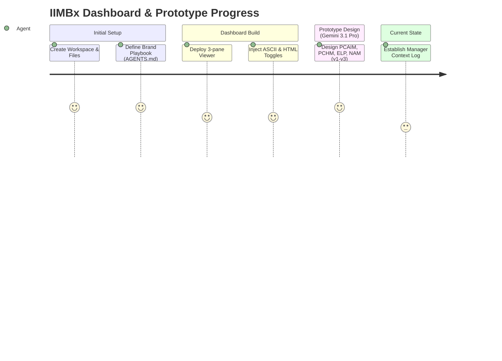

# Manager Context & Workflow Log

> **Manager Agent Directives:** 
> - Read this file at the start of every session to establish context.
> - Log every major progress milestone, rule override, or workflow change here.
> - If the user requests an action that contradicts the **Active Rules & Overrides** table below, STOP and ask for confirmation, detailing the codebase impact.
> - Keep the Mermaid workflow chart updated with lightweight state transitions.

## 1. Visual Workflow State

## 2. Active Rules & Overrides

| Date Set | Original Rule | Current Override / New Rule | Impact if Broken |
| :--- | :--- | :--- | :--- |
| May 29, 2026 | No specific model required for prototyping | **Must use Gemini 3.1 Pro exclusively** | Prototypes will lack consistency and fail to match the generated v2/v3 design systems. |
| May 29, 2026 | HTML fixes are applied directly without performance gating | **Code Quality Agent (20) must optimize for 'lightness'** | Large DOM size, redundant CSS, and slow loading pages. |
| May 29, 2026 | Users manage their own dependencies | **Exa MCP & Stitch MCP are Mandatory** | Agents will fail to fetch live site data or generate proper UI components. |

## 3. Session Progress Log

- **[May 29, 2026 - 17:00 IST]** - Introduced `SETUP.md` and `MANAGER_LOG.md`. Formalized the Manager Agent role to prevent context loss across developer handoffs. Enforced Gemini 3.1 Pro model constraints and code lightness checks.
- **[May 29, 2026 - 15:00 IST]** - Successfully deployed HTML preview/download toggle to the dashboard wireframe viewer.
- **[Jun 08, 2026 - 16:27 IST]** - EXCEPTIONAL CASE: Gemini 3.5 Flash used for Phase 2 of Accounting for Decision Making prototype generation (2 designs). Approved by user. One-time override only.
- **[Jun 08, 2026 - 16:29 IST]** - EXCEPTIONAL CASE: Claude Sonnet 4.6 (Thinking) authorized for ONE design only on Accounting for Decision Making. Stitch MCP + rules-based HTML used together as a single deliverable. Approved by user. One-time override only.
- **[Jun 11, 2026 - 17:14 IST]** - ADM prototype visual alignment verification and grader re-run session. Playwright screenshots being taken of all 4 active ADM designs (adm_v1_variant_1.html, adm_v1_variant_2.html, adm_v1_variant_3.html, adm_v1_variant_5.html). HTML nesting/structural bugs were fixed in the earlier part of today's session. Fixing designs one by one starting with Design 1. ⚠️ NOTE: All ADM graderScores in dashboard/data/data.js are STALE — dated 2026-06-08. Files have been heavily modified since then. A full re-grade is required for all 4 active ADM variants before these scores can be trusted.
