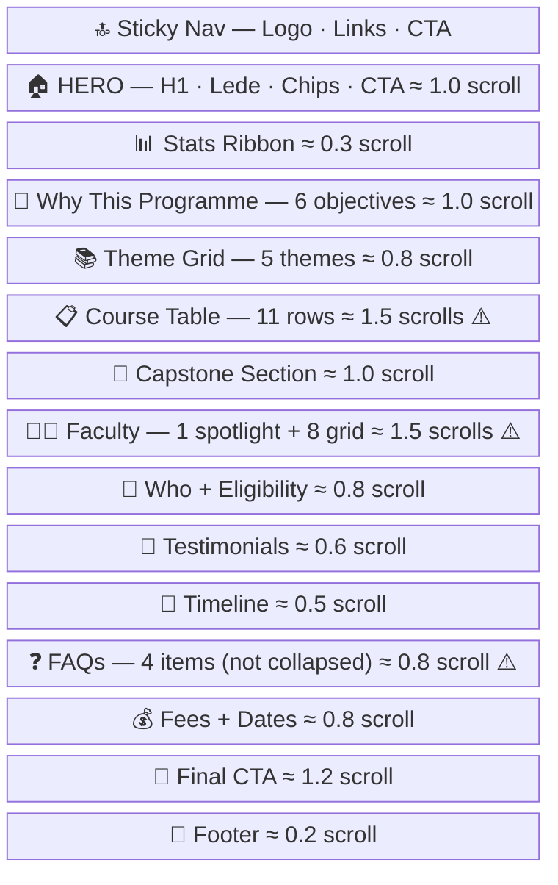
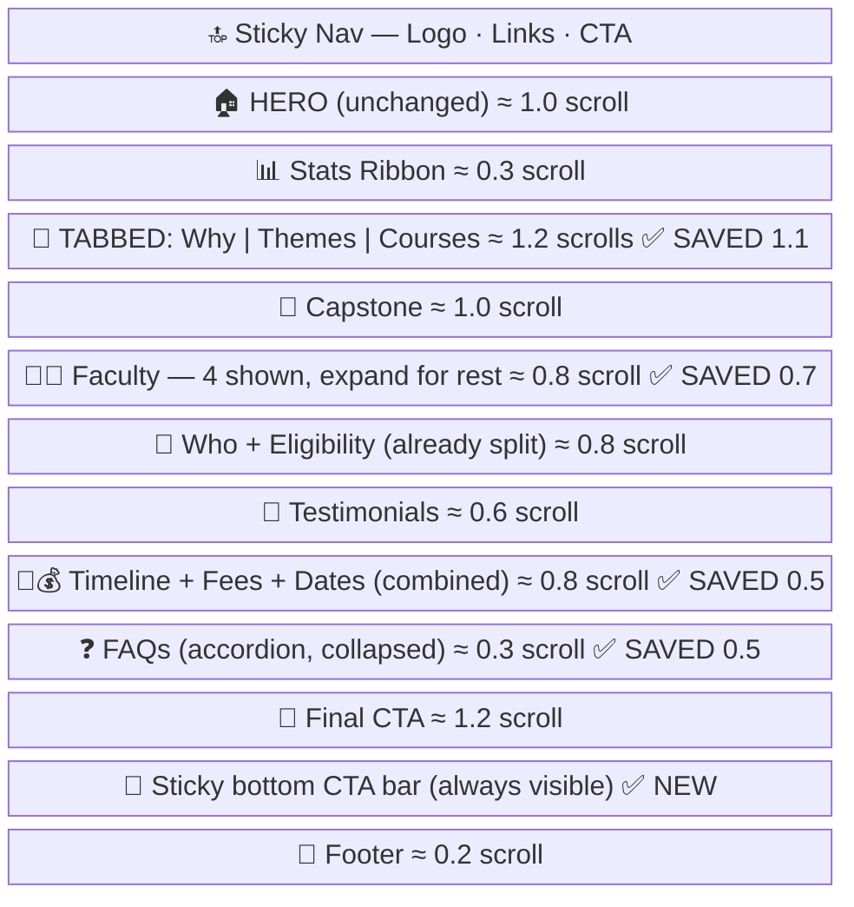

# Agent 14 · Wireframe Generator
**Role:** Synthesizer | **Layer:** 4 | **Input:** Agent 09 (scroll data) + Agent 10 (layout problems)

---

## Purpose
Produce visual wireframe pairs (current layout vs proposed optimization) using **ASCII art and Mermaid block diagrams only**. These wireframes go into the audit report and the dashboard for the PM and designer to review.

**Critical rule: NEVER use `generate_image`. Wireframes are text-only.**

---

## Output Format 1: Mermaid Block Diagram (Page-Level)

Show the full page as a vertical stack of labeled blocks. Each block shows:
- Emoji prefix for scanning
- Section name
- Estimated scroll height
- ⚠️ for problems, ✅ for improvements

**Current Layout Example:**


**Proposed Layout Example:**


---

## Output Format 2: ASCII Wireframe (Section-Level)

For the most bloated section, show a detailed before/after:

```
BEFORE:                          AFTER:
┌────────────────────┐          ┌────────────────────┐
│ Course 01          │          │ [All] [T1] [T2]... │
│ Course 02          │          │ ─────────────────  │
│ Course 03          │          │ ┌──────┐ ┌──────┐  │
│ Course 04          │    →     │ │ C01  │ │ C02  │  │
│ Course 05          │          │ └──────┘ └──────┘  │
│ ...                │          │ ┌──────┐ ┌──────┐  │
│ Course 11          │          │ │ C03  │ │ C04  │  │
└────────────────────┘          └────────────────────┘
  (11 rows = 1.5 scrolls)        (tabbed = 0.8 scrolls)
```

---

## Conventions
- Use `┌ ─ ┐ │ └ ┘` for boxes
- Use `[ Tab ]` syntax for tab bars
- Use `▶ Item` for collapsed accordion, `▼ Item` for expanded
- Keep ASCII width ≤ 55 characters
- Always show scroll savings in the summary line

---

## Output to Coordinator

```
WIREFRAMES:
  page_level:
    current: [Mermaid code block]
    proposed: [Mermaid code block]
  section_level:
    section: "[name]"
    before: [ASCII]
    after: [ASCII]
  scroll_savings:
    current: [X.X] scrolls
    proposed: [Y.Y] scrolls
    saved: [Z.Z] scrolls ([N]% reduction)
```
